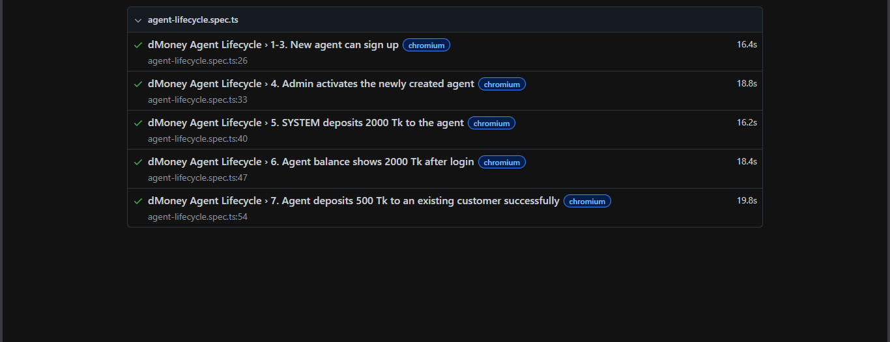

# dMoney Agent Lifecycle — Playwright + JavaScript Automation

Automated end-to-end test for the dMoney QA practice platform
(`https://dmoneyportal.roadtocareer.net`), covering a full Agent lifecycle:
signup → admin activation → SYSTEM funding → agent balance check → agent
deposit to a customer.

## Test Flow

1. Visit `https://dmoneyportal.roadtocareer.net`
2. Click **Sign Up**
3. Register a new account with the **Agent** role
4. Log in as **Admin** and activate the newly created agent
5. Log in as **SYSTEM** and deposit **2000 Tk** to the agent
6. Log in as the **agent** and assert the balance shows **2000 Tk**
7. Deposit **500 Tk** to an existing customer and assert the transaction succeeds

## Why this needed an email-OTP solution

The platform requires OTP verification (sent to a real Gmail inbox) during
Agent/Customer/Merchant signup and login. `utils/gmail-otp-reader.js`
connects to Gmail over IMAP and reads the code straight out of the inbox,
so the whole flow runs unattended. See that file's comments for the full
reasoning.

## Tech Stack

- [Playwright](https://playwright.dev/) + JavaScript
- [imapflow](https://imapflow.com/) + [mailparser](https://nodemailer.com/extras/mailparser/) for automated OTP retrieval
- GitHub Actions for CI/CD

## Project Structure

```
├── .github/workflows/playwright.yml   # CI pipeline
├── services/                          # OOP layer — one class per role/concern
│   ├── base.service.js                #   shared Playwright actions
│   ├── auth.service.js                #   signup + login (any role, auto OTP)
│   ├── admin.service.js               #   agent search + activation
│   ├── system.service.js              #   SYSTEM → agent deposit
│   └── agent.service.js               #   balance check + agent → customer deposit
├── tests/
│   └── agent-lifecycle.spec.js        # the 7-step serial test chain
├── utils/
│   ├── env.js                         # validated environment config
│   ├── test-data.js                   # unique agent data generator per run
│   └── gmail-otp-reader.js            # IMAP-based OTP retrieval
├── .env.example
└── playwright.config.js
```

## Setup

1. Clone the repo and install dependencies:
   ```bash
   npm install
   npx playwright install --with-deps chromium
   ```

2. Copy `.env.example` to `.env` and fill in real values:
   ```bash
   cp .env.example .env
   ```

   You'll need a Gmail **App Password** (not your normal password) for
   `GMAIL_APP_PASSWORD` — generate one at
   [myaccount.google.com/apppasswords](https://myaccount.google.com/apppasswords)
   (requires 2-Step Verification enabled first).

3. Run the tests:
   ```bash
   npm test
   ```
   Or with a visible browser window:
   ```bash
   npm run test:headed
   ```

4. View the HTML report:
   ```bash
   npm run report
   ```

 ## Playwright Report

The project generates an HTML report after every test execution.




